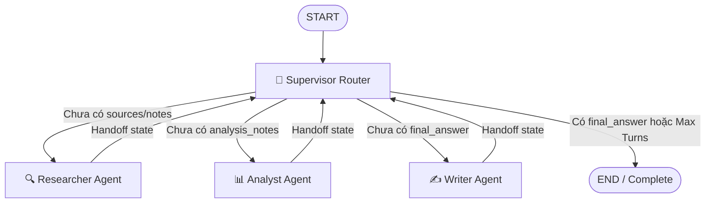

# Multi-Agent Research System Design Specification

## 1. Problem Statement

Xây dựng hệ thống **Autonomous Research Assistant** có khả năng tiếp nhận các câu hỏi nghiên cứu kỹ thuật phức tạp (về AI architectures, LLM systems, Distributed agents), tự động thu thập tài liệu nguồn có kiểm chứng, phân tích sâu các trade-offs kỹ thuật, và soạn thảo báo cáo học thuật hoàn chỉnh kèm trích dẫn chính xác (`[1]`, `[2]`, `[source_id]`).

---

## 2. Why Multi-Agent? (Tại sao Single-Agent chưa đủ?)

| Hạn chế của Single-Agent Baseline | Giải pháp của Multi-Agent Architecture |
|---|---|
| **Quá tải nhận thức (Cognitive Overload)**: 1 prompt đơn lẻ phải đồng thời tìm nguồn, phân tích phản biện và định dạng văn bản $\rightarrow$ dễ bỏ sót chi tiết. | **Chuyên biệt hóa vai trò (Role Specialization)**: Tách riêng Researcher (thu thập), Analyst (phản biện trade-offs), Writer (biên tập) và Critic (kiểm định). |
| **Ảo tưởng dữ liệu (Hallucination)**: Single-Agent không có công cụ tìm kiếm thực nghiệm nên thường tự bịa nguồn trích dẫn. | **Kiểm chứng nguồn thật (Evidence Grounding)**: Researcher truy xuất tài liệu thực tế và chuyển giao vào `ResearchState.sources` trước khi viết. |
| **Thiếu kiểm soát vòng lặp**: Khó bắt lỗi và điều phối lại nếu một khâu bị lỗi. | **Điều phối có giám sát (Supervisor Routing & Guardrails)**: Supervisor kiểm tra trạng thái state ở từng turn, enforces `max_iterations`, timeout và retry. |

---

## 3. Agent Roles & Specifications

| Agent | Responsibility | Input | Output | Failure Mode & Mitigation |
|---|---|---|---|---|
| **🧭 Supervisor** | Điều phối luồng, kiểm tra state hiện tại, quyết định agent tiếp theo hoặc dừng. | `ResearchState` | `next_route` (`researcher`, `analyst`, `writer`, `done`) | **Lặp vô hạn** $\rightarrow$ Ép `max_iterations = 6` và fallback về Writer/Done. |
| **🔍 Researcher** | Tìm kiếm tài liệu nguồn (Tavily/Corpus), trích xuất snippets và ghi chú ban đầu. | `state.request.query`, `max_sources` | `state.sources`, `state.research_notes` | **Nguồn yếu/mất mạng** $\rightarrow$ Tự động kích hoạt Fallback Knowledge Corpus. |
| **📊 Analyst** | Phân tích sâu: bóc tách kiến trúc, so sánh trade-offs (Latency, Cost, Accuracy), chỉ ra failure modes. | `state.research_notes`, `state.sources` | `state.analysis_notes` | **Phân tích hời hợt** $\rightarrow$ Áp dụng structured prompt với 4 mục cốt lõi và $T=0.1$. |
| **✍️ Writer** | Soạn thảo báo cáo kỹ thuật hoàn chỉnh dạng Markdown kèm trích dẫn bibliography chuẩn. | `state.research_notes`, `state.analysis_notes`, `state.sources` | `state.final_answer` | **Quên trích dẫn** $\rightarrow$ System prompt ràng buộc gắn inline citations `[1]`, `[2]`. |
| **🛡️ Critic** | Kiểm tra chéo factuality, độ bao phủ trích dẫn và phát hiện lỗi ảo tưởng dữ liệu. | `state.final_answer`, `state.sources` | Audit feedback, validation score | **Bỏ sót lỗi** $\rightarrow$ Chạy chế độ zero-temperature audit. |

---

## 4. Shared State Design (`ResearchState`)

State được thiết kế theo chuẩn Pydantic v2 để đảm bảo tính bất biến và type-safety:

```python
class ResearchState(BaseModel):
    request: ResearchQuery               # Câu truy vấn gốc, audience, max_sources
    iteration: int = 0                   # Đếm số vòng lặp thực thi
    route_history: list[str]             # Lịch sử các bước handoff đã đi qua
    sources: list[SourceDocument]        # Danh sách tài liệu nguồn thu thập được
    research_notes: str | None           # Ghi chú tổng hợp thô của Researcher
    analysis_notes: str | None           # Phân tích phản biện và trade-offs của Analyst
    final_answer: str | None             # Báo cáo Markdown hoàn chỉnh của Writer
    agent_results: list[AgentResult]     # Kết quả chi tiết và chi phí USD từng agent
    trace: list[dict[str, Any]]          # Telemetry trace phục vụ Langfuse/LangSmith
    errors: list[str]                    # Danh sách lỗi bắt được trong quá trình chạy
```

---

## 5. Routing Policy & LangGraph Architecture



**Quy tắc điều phối:**
1. `iteration >= max_iterations` $\rightarrow$ Chuyển sang `done` (Guardrail).
2. `not state.research_notes and not state.sources` $\rightarrow$ Chuyển sang `researcher`.
3. `not state.analysis_notes` $\rightarrow$ Chuyển sang `analyst`.
4. `not state.final_answer` $\rightarrow$ Chuyển sang `writer`.
5. `state.final_answer is present` $\rightarrow$ Chuyển sang `done`.

---

## 6. Production Guardrails

- **Max Iterations**: Mặc định `6` vòng lặp. Ngăn ngừa vòng lặp vô hạn giữa các agent.
- **Timeout**: Timeout `60s` cho mỗi request mạng và gọi LLM.
- **Search Fallback**: Tự động chuyển đổi sang Offline Topic Corpus nếu API Search bên ngoài (Tavily) gặp sự cố mạng hoặc thiếu key.
- **LLM Error Handling**: Bọc `try-except` xung quanh các API call và ghi nhận vào `state.errors`.
- **Validation**: Kiểm tra schema Pydantic trước và sau mỗi node.

---

## 7. Benchmark Plan

- **Dataset**: 30 Offline Topic Corpus (`ai_agent_offline_research_corpus_30_topics_v2`).
- **Baselines**: Single-Agent Baseline (1 LLM call) vs Multi-Agent Graph (Supervisor + 4 Workers).
- **Core Metrics**:
  1. *Latency (s)*: Thời gian hoàn thành chu trình.
  2. *Token Cost (USD)*: Tổng chi phí token dựa trên giá OpenAI gpt-4o-mini.
  3. *Quality Score (0 - 10)*: Đánh giá chiều sâu kỹ thuật, trade-offs, cấu trúc và guardrails.
  4. *Citation Coverage (%)*: Tỷ lệ trích dẫn nguồn chuẩn xác, hạn chế hallucination.
  5. *Failure Rate (%)*: Tỷ lệ fail hoặc không sinh được kết quả.
